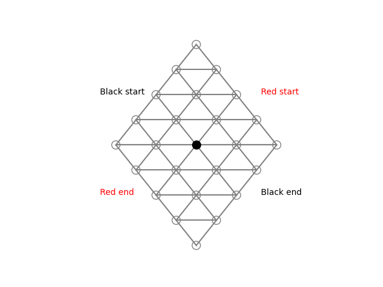
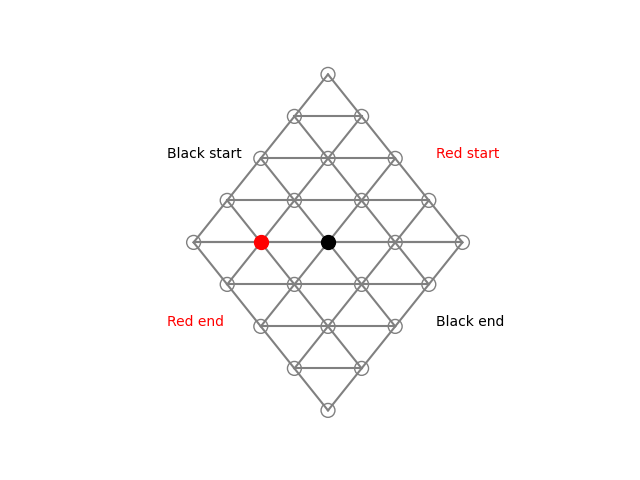
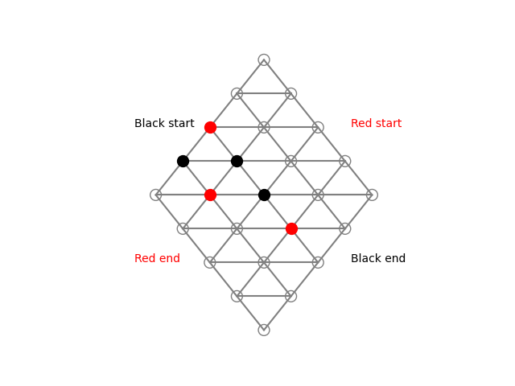
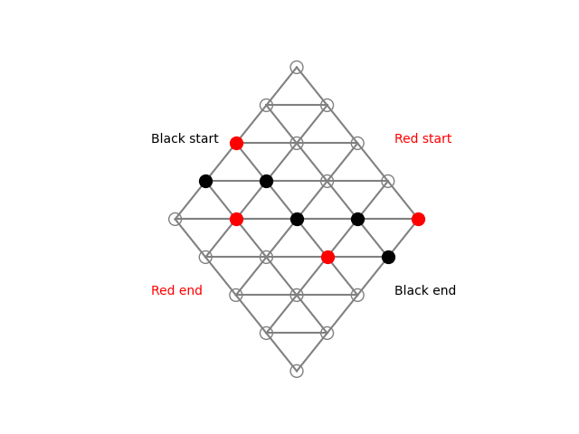

# IT3105 AI Programming - Spring 2024 Projects

This repository contains my work for the two projects in the IT3105 AI Programming course held at NTNU in the spring of 2024.

## Project 1: PID-Controller Calibration using Reinforcement Learning

The first project, although minor in comparison to the second, is an important exploration of reinforcement learning for calibrating a PID-controller for various plants. These plants, such as maintaining a constant temperature in a room given disturbances and heat loss through walls, are controlled using the PID-controller acting on a single actuator in the environment. The calibration of the reinforcement learning algorithm is done through the use of JAX and is implemented in Python.

*Results and example images will be added here.*

## Project 2: Deep Reinforcement Learning for Hex

The second project, which forms the majority of the course, revolves around creating a deep reinforcement learning algorithm. This algorithm is used to train and perfect an agent capable of playing Hex, a two-player perfect information game. This project also includes setting up code for online plays against other players through servers, and a self-playing capability in a TOP tournament, playing against former versions of itself to prove improvements over time. The algorithm itself is inspired by the architecture used for the well-known AlphaGo.

The project employs the Monte Carlo Tree Search (MCTS) method. MCTS is a heuristic search algorithm used in artificial intelligence and computer games for decision-making. The algorithm combines tree search with random sampling to find near-optimal solutions. It performs random sampling in the form of simulations and stores the statistics of actions to make more educated choices in each subsequent iteration. MCTS only searches a few layers deep into the tree and prioritizes which parts of the tree to explore. It then simulates the outcome rather than exhaustively expanding the search space.

Example of a play by two agents, in a 5x5 game of Hex:

|  |  |
|:---:|:---:|
| Fig.1 - Black always plays first | Fig.2 - Red moves to block or win |
|  |  |
| Fig.3 - The game continues | Fig.4 - Black won by connecting its two sides |
